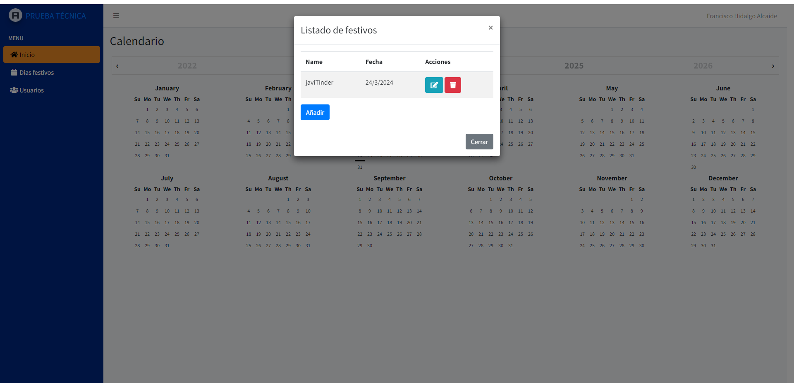
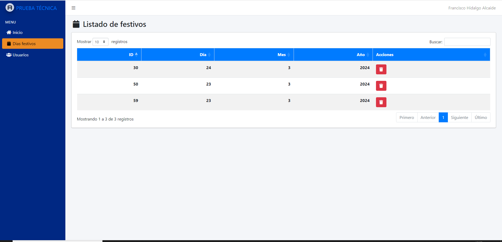
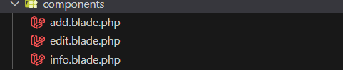
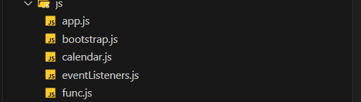

## Librerias usadas

- **[Data Table js](https://datatables.net/). -> Herramienta usada para paginación
- **[Jquery](https://jquery.com/). -> Jquery maneja todo el segmento de consultas api y manejo de modales
- **[bootstrap 4](https://getbootstrap.com/).

## Vista previa

La aplicación cargará directamente nuestra página de login

Nos redirige a nuestra pantalla de inicio donde se harán todas las consultas a la bd de datos

Crud de usarios, el campo login cual está autenticado

Si quieres buscar un día en específico para borrarlo se puede hacer tambien mediante la vista días festivos

## Configuración
Si se quiere añadir un modal se recomienda añadirlo en la carpeta components e importalo donde se vaya a usar

También se recomienda seguir la estructura de los archivos js

## License

The Laravel framework is open-sourced software licensed under the [MIT license](https://opensource.org/licenses/MIT).
